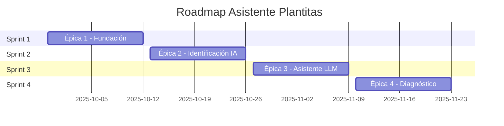

# 🌱 Asistente de Jardinería y Cuidado de Plantas - Plan Ágil

## 📊 Información General del Proyecto

**Nombre**: Asistente de Jardinería y Cuidado de Plantas
**Duración**: 8 semanas (2 meses)
**Metodología**: Scrum/Ágil 
**Sprint Duration**: 2 semanas
**Total Sprints**: 4

### 👥 Equipo del Proyecto (5 colaboradores)

| Rol | Responsabilidad | Cantidad |
|-----|----------------|----------|
| **Scrum Master/Product Owner** | Gestión ágil, ceremonias, requisitos | 1 |
| **Desarrolladores Full Stack** | FastAPI + Angular + PostgreSQL | 2 |
| **Especialista IA/ML** | Visión por computadora + LLM | 1 |
| **DevOps/QA Engineer** | Testing + Deployment Azure | 1 |

## 🎯 Épicas del Proyecto

### 📈 Roadmap de Épicas



## 🏗️ ÉPICA 1: Fundación de la Aplicación
**Sprint 1** (29 Sep - 12 Oct 2025)

### 📱 Historia de Usuario Principal
> **Como** usuario interesado en jardinería  
> **Quiero** acceder a una aplicación web donde pueda registrarme y subir fotos de plantas  
> **Para** comenzar a usar el asistente de jardinería

### 🎯 Objetivos del Sprint
- Establecer arquitectura base del proyecto
- Implementar sistema de autenticación
- Crear interfaz básica de usuario
- Configurar pipeline de deployment

### 📋 Features y User Stories

#### Feature 1.1: Sistema de Autenticación
**Valor de Negocio**: Alto | **Effort**: 13 puntos

- **US-001**: Como usuario nuevo, quiero registrarme con email y contraseña
- **US-002**: Como usuario registrado, quiero hacer login para acceder a mis plantas
- **US-003**: Como usuario, quiero que mi sesión sea segura con JWT

#### Feature 1.2: Gestión de Imágenes
**Valor de Negocio**: Alto | **Effort**: 8 puntos

- **US-004**: Como usuario, quiero subir fotos desde mi dispositivo
- **US-005**: Como usuario, quiero tomar fotos con la cámara
- **US-006**: Como usuario, quiero ver un preview de mi foto antes de subirla

#### Feature 1.3: Infraestructura Base
**Valor de Negocio**: Alto | **Effort**: 21 puntos

- **US-007**: Como desarrollador, quiero un entorno de desarrollo dockerizado
- **US-008**: Como equipo, queremos CI/CD automatizado en Azure
- **US-009**: Como usuario, quiero una interfaz responsiva y moderna

### 🔧 Tasks Técnicas por Área

#### Backend (FastAPI) - 34 puntos
- **T-001**: Configurar proyecto FastAPI con estructura MVC (5pts)
- **T-002**: Implementar modelos de usuario con SQLAlchemy (8pts)
- **T-003**: Crear endpoints de autenticación JWT (13pts)
- **T-004**: Desarrollar API de subida de imágenes (8pts)

#### Frontend (Angular) - 29 puntos
- **T-005**: Setup Angular 17 con Tailwind CSS (5pts)
- **T-006**: Implementar componentes de login/registro (13pts)
- **T-007**: Crear servicio de autenticación (8pts)
- **T-008**: Desarrollar componente de subida de fotos (8pts)

#### Infraestructura/DevOps - 21 puntos
- **T-009**: Configurar Docker Compose para desarrollo (5pts)
- **T-010**: Setup PostgreSQL con migraciones (8pts)
- **T-011**: Configurar Azure DevOps pipelines (8pts)

### ✅ Criterios de Aceptación MVP

| Criterio | Estado | Prioridad |
|----------|--------|-----------|
| Usuario puede registrarse y hacer login | 🔲 | Crítico |
| Usuario puede subir imágenes desde dispositivo/cámara | 🔲 | Crítico |
| Sistema guarda imágenes en el servidor | 🔲 | Crítico |
| Interfaz responsiva básica | 🔲 | Alta |

---

## 🧠 ÉPICA 2: Identificación de Plantas (IA Core)
**Sprint 2** (13-26 Oct 2025) - **🚀 ENTREGA MVP**

### 📱 Historia de Usuario Principal
> **Como** usuario con una foto de planta  
> **Quiero** que la aplicación identifique automáticamente la especie  
> **Para** conocer información básica sobre mi planta

### 🎯 Objetivos del Sprint
- Integrar APIs de identificación de plantas
- Implementar procesamiento de imágenes
- Crear interfaz de resultados
- **Entregar MVP funcional**

### 📋 Features y User Stories

#### Feature 2.1: Motor de Identificación IA
**Valor de Negocio**: Crítico | **Effort**: 21 puntos

- **US-010**: Como usuario, quiero que identifique plantas con alta precisión
- **US-011**: Como usuario, quiero ver el nivel de confianza del resultado
- **US-012**: Como usuario, quiero información básica de la especie identificada

#### Feature 2.2: Gestión de Resultados
**Valor de Negocio**: Alto | **Effort**: 13 puntos

- **US-013**: Como usuario, quiero ver mis plantas identificadas anteriormente
- **US-014**: Como usuario, quiero editar o confirmar identificaciones
- **US-015**: Como usuario, quiero búsqueda en mi historial

### 🔧 Tasks Técnicas por Área

#### IA/ML - 34 puntos
- **T-012**: Integración con PlantNet API (13pts)
- **T-013**: Servicio de procesamiento de imágenes (8pts)
- **T-014**: Sistema de cache de resultados (5pts)
- **T-015**: Implementar fallback con modelos locales (8pts)

#### Backend (FastAPI) - 21 puntos
- **T-016**: Endpoint `/api/plantas/identificar` (8pts)
- **T-017**: Modelos de datos para especies (5pts)
- **T-018**: Sistema de logging de resultados IA (8pts)

#### Frontend (Angular) - 29 puntos
- **T-019**: Componente de resultado de identificación (13pts)
- **T-020**: Loading states durante procesamiento (5pts)
- **T-021**: Galería de plantas identificadas (8pts)
- **T-022**: Componente de búsqueda y filtros (3pts)

### ✅ Criterios de Aceptación MVP

| Criterio | Estado | Prioridad |
|----------|--------|-----------|
| Sistema identifica plantas con >70% precisión | 🔲 | Crítico |
| Muestra información básica de la especie | 🔲 | Crítico |
| Tiempo de respuesta <10 segundos | 🔲 | Alta |
| Manejo de errores de APIs externas | 🔲 | Alta |

**🎉 HITO: ENTREGA MVP AL FINAL DEL SPRINT 2**

---

## 💬 ÉPICA 3: Asistente Inteligente con LLM
**Sprint 3** (27 Oct - 9 Nov 2025)

### 📱 Historia de Usuario Principal
> **Como** usuario con plantas identificadas  
> **Quiero** recibir consejos personalizados de cuidado y hacer preguntas específicas  
> **Para** mantener mis plantas saludables

### 🎯 Objetivos del Sprint
- Integrar LLM para consejos personalizados
- Implementar chat conversacional
- Crear sistema de knowledge base
- Desarrollar recomendaciones estacionales

### 📋 Features y User Stories

#### Feature 3.1: Chat IA Inteligente
**Valor de Negocio**: Alto | **Effort**: 21 puntos

- **US-016**: Como usuario, quiero hacer preguntas sobre el cuidado de mi planta
- **US-017**: Como usuario, quiero respuestas contextuales y personalizadas  
- **US-018**: Como usuario, quiero que recuerde nuestra conversación

#### Feature 3.2: Consejos Automatizados
**Valor de Negocio**: Alto | **Effort**: 13 puntos

- **US-019**: Como usuario, quiero recibir consejos específicos por especie
- **US-020**: Como usuario, quiero recomendaciones estacionales
- **US-021**: Como usuario, quiero recordatorios de cuidado

### 🔧 Tasks Técnicas por Área

#### IA/LLM - 34 puntos
- **T-023**: Integración con Azure OpenAI/Claude API (13pts)
- **T-024**: Desarrollo de prompts especializados (8pts)
- **T-025**: Sistema de contexto conversacional (8pts)
- **T-026**: Knowledge base de plantas común (5pts)

#### Backend (FastAPI) - 21 puntos
- **T-027**: Endpoint `/api/chat/consejos` (8pts)
- **T-028**: Sistema de historial de conversaciones (8pts)
- **T-029**: Rate limiting para APIs pagas (5pts)

#### Frontend (Angular) - 21 puntos
- **T-030**: Chat interface para consultas (13pts)
- **T-031**: Componente de consejos personalizados (5pts)
- **T-032**: Cards de cuidados estacionales (3pts)

### ✅ Criterios de Aceptación

| Criterio | Estado | Prioridad |
|----------|--------|-----------|
| Chat fluido con respuestas contextuales | 🔲 | Crítico |
| Consejos específicos por especie | 🔲 | Alta |
| Recomendaciones estacionales | 🔲 | Media |
| Historial persistente de consultas | 🔲 | Alta |

---

## 🏥 ÉPICA 4: Detección de Enfermedades y Marketplace
**Sprint 4** (10-23 Nov 2025) - **🚀 ENTREGA FINAL**

### 📱 Historia de Usuario Principal
> **Como** usuario preocupado por la salud de mi planta  
> **Quiero** que la aplicación detecte enfermedades y me recomiende tratamientos  
> **Para** mantener mis plantas saludables y poder comprar productos necesarios

### 🎯 Objetivos del Sprint
- Implementar detección de enfermedades
- Integrar marketplace de productos
- Crear dashboard completo
- **Entregar producto final**

### 📋 Features y User Stories

#### Feature 4.1: Diagnóstico IA Avanzado
**Valor de Negocio**: Alto | **Effort**: 21 puntos

- **US-022**: Como usuario, quiero detección automática de enfermedades
- **US-023**: Como usuario, quiero análisis de severidad
- **US-024**: Como usuario, quiero recomendaciones de tratamiento

#### Feature 4.2: Marketplace Integrado
**Valor de Negocio**: Medio | **Effort**: 13 puntos

- **US-025**: Como usuario, quiero ver productos recomendados
- **US-026**: Como usuario, quiero comparar precios
- **US-027**: Como usuario, quiero encontrar tiendas cercanas

#### Feature 4.3: Dashboard Personal
**Valor de Negocio**: Alto | **Effort**: 8 puntos

- **US-028**: Como usuario, quiero un dashboard de salud de plantas
- **US-029**: Como usuario, quiero alertas y notificaciones
- **US-030**: Como usuario, quiero mi perfil de jardín personal

### 🔧 Tasks Técnicas por Área

#### IA Avanzada - 29 puntos
- **T-033**: Modelo de detección de enfermedades (13pts)
- **T-034**: Clasificación de tipos de daño (8pts)
- **T-035**: Análisis de severidad (5pts)
- **T-036**: Recomendaciones de tratamiento (3pts)

#### Integraciones API - 21 puntos
- **T-037**: API de tiendas de jardinería (8pts)
- **T-038**: Sistema de recomendaciones de productos (8pts)
- **T-039**: Comparador de precios (3pts)
- **T-040**: Localización de tiendas cercanas (2pts)

#### Backend & Frontend - 34 puntos
- **T-041**: Endpoints de diagnóstico (8pts)
- **T-042**: API de productos/marketplace (8pts)
- **T-043**: Dashboard de salud de plantas (8pts)
- **T-044**: Sistema de alertas/notificaciones (5pts)
- **T-045**: Marketplace integrado (5pts)

### ✅ Criterios de Aceptación Final

| Criterio | Estado | Prioridad |
|----------|--------|-----------|
| Detección de enfermedades con >60% precisión | 🔲 | Alto |
| Recomendaciones de tratamiento específicas | 🔲 | Crítico |
| Integración funcional con tiendas online | 🔲 | Media |
| Dashboard completo de jardín personal | 🔲 | Alto |

**🎉 HITO: ENTREGA FINAL DEL PRODUCTO**

---

## 🔄 Metodología Ágil - Configuración Scrum

### 📅 Calendario de Sprints

| Sprint | Fechas | Duración | Entrega |
|--------|--------|----------|---------|
| **Sprint 1** | 29 Sep - 12 Oct | 2 semanas | Base del proyecto |
| **Sprint 2** | 13 Oct - 26 Oct | 2 semanas | **🚀 MVP** |
| **Sprint 3** | 27 Oct - 9 Nov | 2 semanas | Asistente IA |
| **Sprint 4** | 10 Nov - 23 Nov | 2 semanas | **🚀 Producto Final** |

### 🎪 Ceremonias Ágiles

#### Sprint Planning (4 horas)
- **Cuándo**: Lunes de la semana 1 de cada sprint
- **Participantes**: Todo el equipo
- **Objetivo**: Seleccionar user stories y planificar sprint

#### Daily Standups (15 minutos)
- **Cuándo**: Diario 9:00 AM
- **Participantes**: Equipo de desarrollo
- **Preguntas**:
  - ¿Qué hice ayer?
  - ¿Qué haré hoy?
  - ¿Hay impedimentos?

#### Sprint Review (2 horas)
- **Cuándo**: Viernes semana 2 de cada sprint
- **Participantes**: Equipo + Stakeholders
- **Objetivo**: Demo del incremento desarrollado

#### Sprint Retrospective (1 hora)
- **Cuándo**: Viernes semana 2 de cada sprint
- **Participantes**: Equipo de desarrollo
- **Objetivo**: Mejora continua

### ✅ Definition of Done

Para considerar una historia de usuario como "Done":

- [ ] **Código revisado** por peer review
- [ ] **Tests unitarios** >80% cobertura
- [ ] **Documentación** actualizada (README, API docs)
- [ ] **Funcionalidad probada** en ambiente de testing
- [ ] **No bloquea** funcionalidades existentes
- [ ] **Cumple criterios** de aceptación
- [ ] **Deployed** en ambiente de desarrollo

### 📊 Estimación por Story Points

| Complejidad | Story Points | Tiempo Estimado |
|-------------|--------------|-----------------|
| Muy Simple | 1-2 | 1-4 horas |
| Simple | 3 | 4-8 horas |
| Medio | 5 | 1 día |
| Complejo | 8 | 2 días |
| Muy Complejo | 13 | 3 días |
| Épico | 21+ | >3 días |

---

## 🚀 Deployment en Azure

### 🏗️ Estrategia de Deployment

#### Ambientes por Sprint

| Sprint | Ambiente | Propósito | URL |
|--------|----------|-----------|-----|
| 1 | **Development** | Desarrollo activo | `dev-plantitas.azurewebsites.net` |
| 2 | **Testing** | Demo MVP | `test-plantitas.azurewebsites.net` |
| 3 | **Staging** | Testing completo | `staging-plantitas.azurewebsites.net` |
| 4 | **Production** | Entrega final | `plantitas.azurewebsites.net` |

#### Recursos Azure por Ambiente

```yaml
Development:
  - Resource Group: rg-plantitas-dev
  - App Service: app-plantitas-dev (Basic B1)
  - Database: PostgreSQL Flexible Server (Burstable B1ms)
  - Storage: Blob Storage para imágenes

Testing:
  - Resource Group: rg-plantitas-test  
  - Container Apps: 2 apps (frontend/backend)
  - Database: PostgreSQL Flexible Server (General Purpose D2s)
  - Application Insights: Monitoreo

Production:
  - Resource Group: rg-plantitas-prod
  - Container Apps: Auto-scaling
  - Database: PostgreSQL Flexible Server (General Purpose D4s)  
  - CDN: Azure Front Door
  - Key Vault: Secrets management
```

### 🔄 Pipeline CI/CD

```yaml
# azure-pipelines.yml
trigger:
  branches:
    include:
      - main
      - develop
      - feature/*

stages:
  - stage: Build
    jobs:
      - job: BuildBackend
        steps:
          - task: Python@0
            inputs:
              version: '3.11'
          - script: pip install -r requirements.txt
          - script: pytest tests/ --cov=app
      
      - job: BuildFrontend  
        steps:
          - task: Node@4
            inputs:
              version: '18.x'
          - script: npm ci
          - script: npm run build
          - script: npm test

  - stage: Deploy
    condition: and(succeeded(), eq(variables['Build.SourceBranch'], 'refs/heads/main'))
    jobs:
      - deployment: DeployToAzure
        environment: 'plantitas-prod'
        strategy:
          runOnce:
            deploy:
              steps:
                - task: AzureContainerApps@1
```

---

## 📈 Métricas y KPIs

### 🎯 Métricas de Desarrollo

| Métrica | Objetivo | Medición |
|---------|----------|----------|
| **Velocity** | 40-50 story points/sprint | Burndown charts |
| **Code Coverage** | >80% | Automated tests |
| **Bug Rate** | <2 bugs/sprint | Azure DevOps tracking |
| **Lead Time** | <3 días | Work item analytics |

### 📊 Métricas de Producto (Post-MVP)

| Métrica | Objetivo | Herramienta |
|---------|----------|-------------|
| **Precisión IA** | >70% identificación | Application Insights |
| **Tiempo Respuesta** | <10 segundos | Azure Monitor |
| **Satisfacción Usuario** | >4/5 rating | Feedback forms |
| **Retention Rate** | >60% weekly | Analytics |

---

## 🔧 Herramientas y Stack Tecnológico

### 🏗️ Desarrollo

| Área | Tecnología | Propósito |
|------|------------|-----------|
| **Backend** | FastAPI + SQLAlchemy | API REST |
| **Frontend** | Angular 17 + Tailwind | SPA |
| **Database** | PostgreSQL | Datos relacionales |
| **IA/ML** | PlantNet API + OpenAI | Identificación + Chat |
| **Container** | Docker + Docker Compose | Containerización |

### ☁️ Azure Services

| Servicio | Uso | Sprint |
|----------|-----|--------|
| **Azure DevOps** | Project management | 1-4 |
| **Container Apps** | Hosting applications | 2-4 |
| **PostgreSQL Flexible Server** | Database | 1-4 |
| **Application Insights** | Monitoring | 2-4 |
| **Key Vault** | Secrets management | 3-4 |
| **Blob Storage** | Image storage | 1-4 |

### 🔄 Gestión Ágil

| Tool | Propósito | Equipo |
|------|-----------|--------|
| **Azure Boards** | Work items, sprints | Todo el equipo |
| **Azure Repos** | Git repositories | Developers |
| **Azure Pipelines** | CI/CD | DevOps |
| **Application Insights** | Performance monitoring | QA/DevOps |

---

## 🎉 Entregables y Demos

### 📦 Sprint Deliverables

#### Sprint 1 - Fundación
- [ ] Proyecto configurado en Azure DevOps
- [ ] Pipeline CI/CD funcional
- [ ] Aplicación base desplegada
- [ ] Sistema de autenticación implementado
- [ ] Demo: Login + Upload de imágenes

#### Sprint 2 - MVP
- [ ] **🚀 MVP Funcional**
- [ ] IA de identificación operativa
- [ ] API REST completa
- [ ] Frontend con resultados
- [ ] Demo: Identificación de plantas end-to-end

#### Sprint 3 - Asistente IA
- [ ] Chat conversacional implementado
- [ ] Sistema de consejos personalizados
- [ ] Historial de conversaciones
- [ ] Demo: Consultas sobre cuidado de plantas

#### Sprint 4 - Producto Final
- [ ] **🚀 Producto Completo**
- [ ] Detección de enfermedades
- [ ] Marketplace integrado
- [ ] Dashboard de jardín personal
- [ ] Demo: Flujo completo de usuario

---

## 📋 Checklist de Setup Inicial

### ✅ Azure DevOps Project Setup

- [ ] Crear proyecto "Asistente Plantitas"
- [ ] Configurar repositorio Git
- [ ] Crear work item types personalizados
- [ ] Setup de áreas y iteraciones
- [ ] Configurar equipos y permisos
- [ ] Crear boards ágiles personalizados

### ✅ Development Environment

- [ ] Setup Azure subscriptions
- [ ] Configurar resource groups
- [ ] Deploy infrastructure base
- [ ] Configurar secrets en Key Vault
- [ ] Setup monitoring y alertas
- [ ] Crear ambientes de desarrollo

### ✅ Team Onboarding

- [ ] Onboarding session con el equipo
- [ ] Definir working agreements
- [ ] Setup herramientas de desarrollo
- [ ] Configurar accesos y permisos
- [ ] Primera retrospectiva de setup

---

**🌱 ¡Listo para comenzar el desarrollo del Asistente de Plantas! 🌱**

*Este documento será actualizado durante el desarrollo del proyecto para reflejar cambios y lecciones aprendidas.*